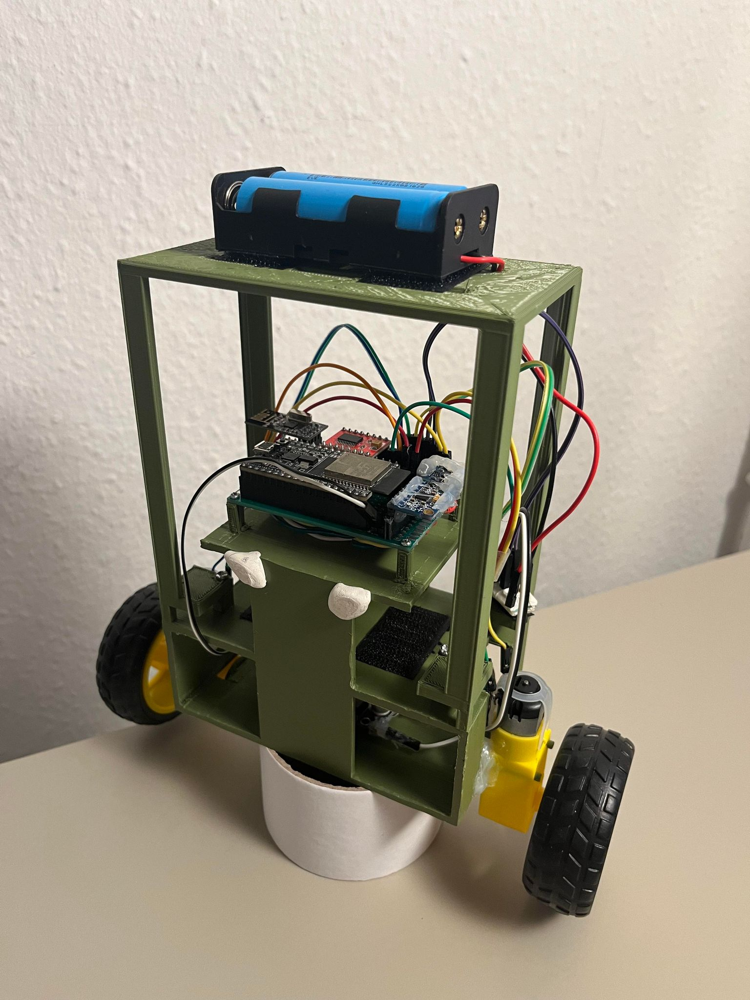
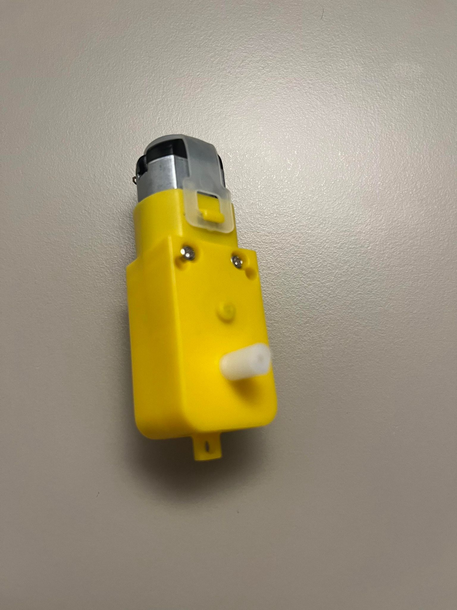
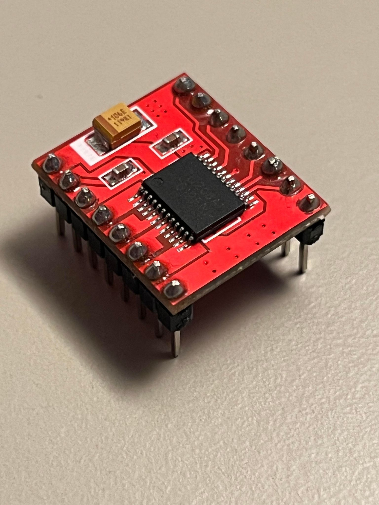
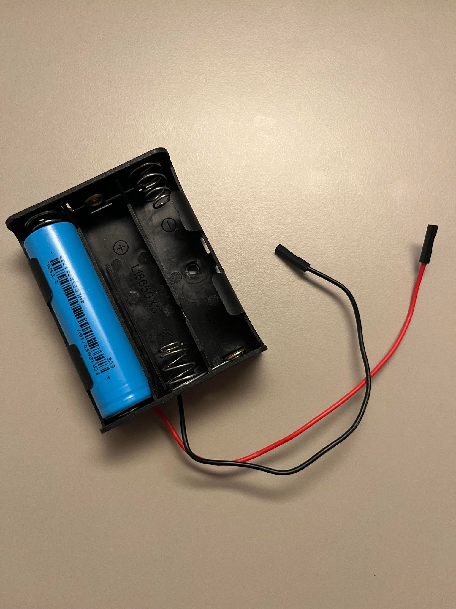
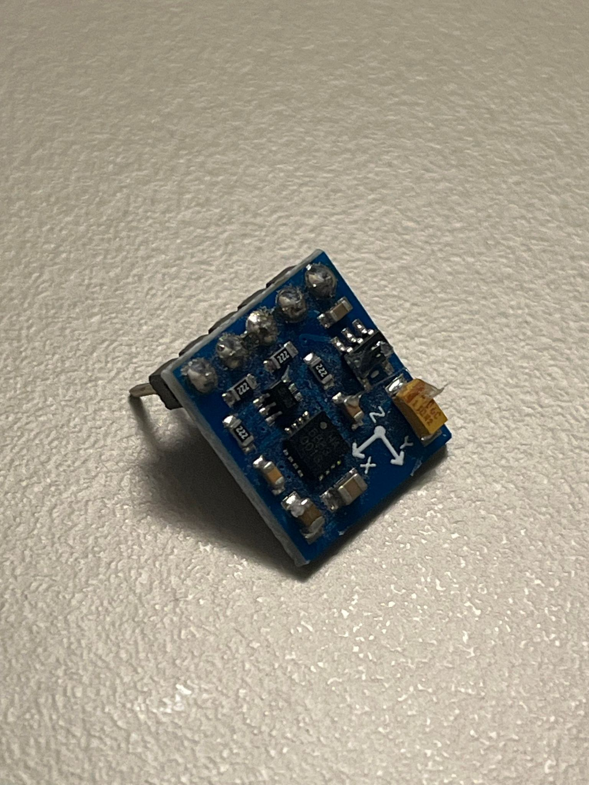
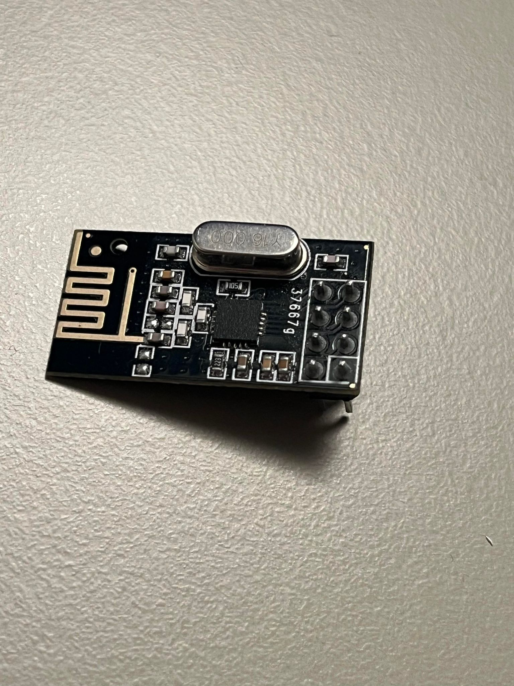
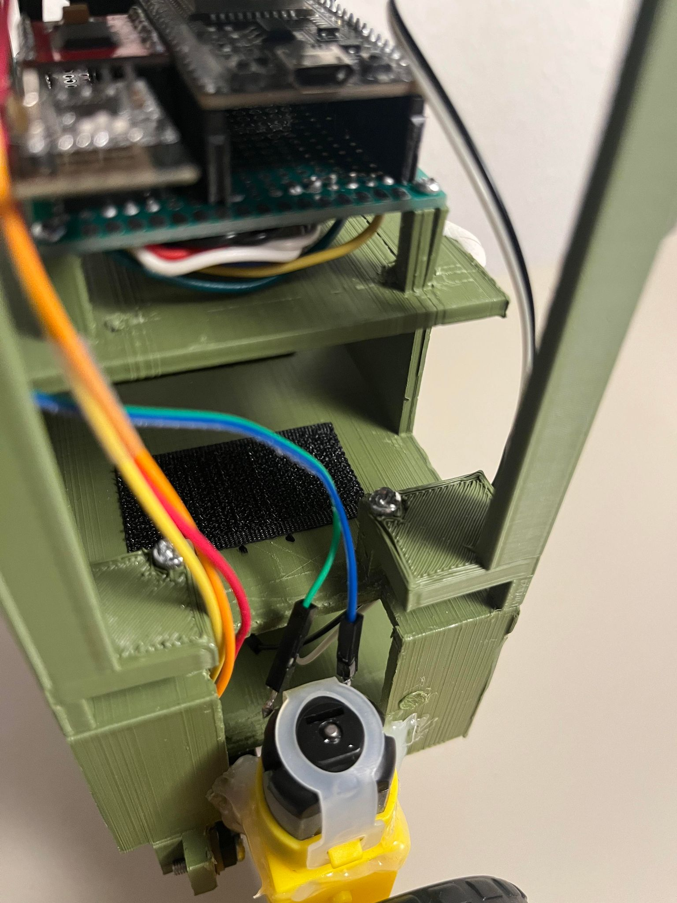
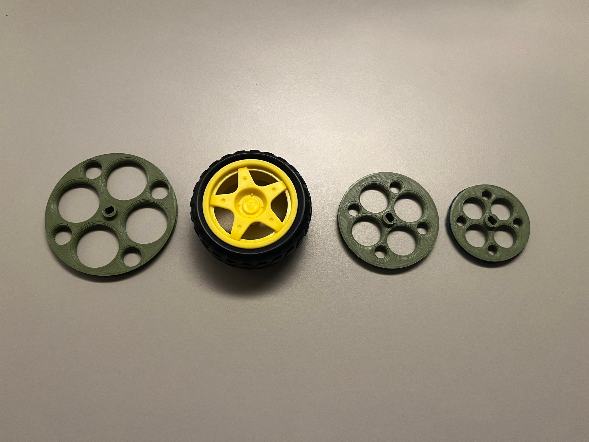
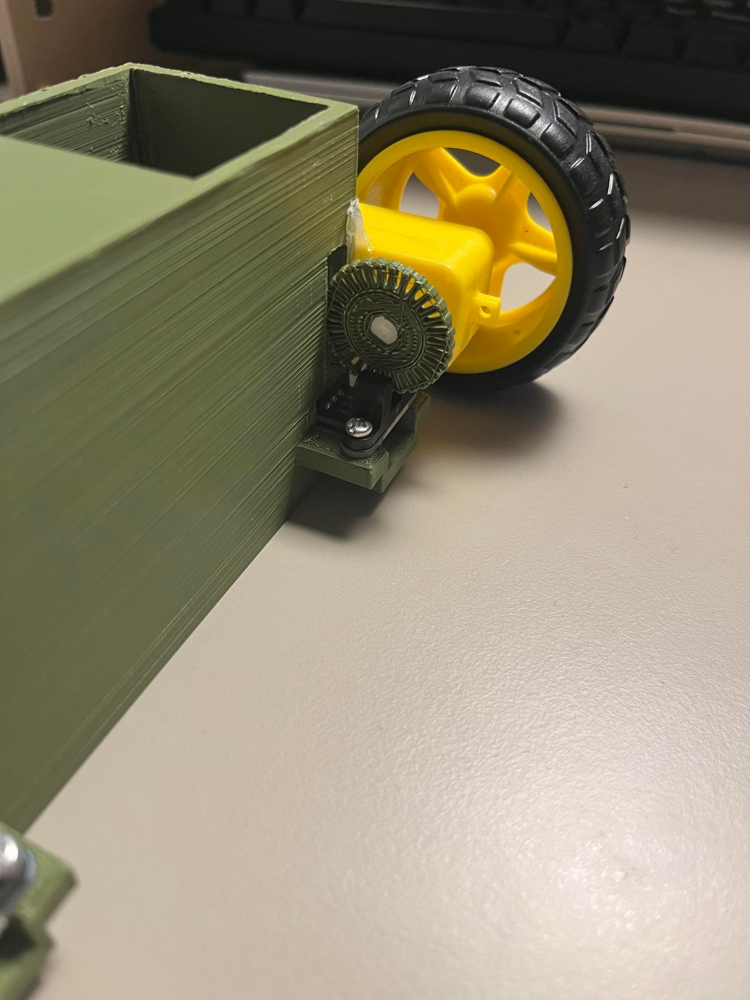
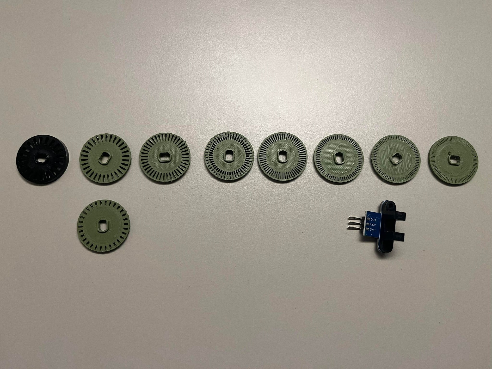

# ESP32 self balancing robot V2 [First version can be found here.](README_old.md)

This is my self balancing robot. It is the second version of the robot with improved code and frame. The robot alone can maintain an upright position and consistently point to a specific yaw direction hold ground when it is turned on while being upright. When the robot is paired with a compatible remote controller, [like the remote i created here](https://github.com/Rokas-embedded/Pi-Pico-remote-control), it can also change the direction it is pointing to and more forward or backwards. The remote controlled functionality is not the best as my robot cannot sense which direction its wheels are spinning. The robot can only perform these remote control actions because it uses what it has from its limited encoder data and its state data without which which such functionality would not be possible.

# Video demonstrations

[Tall robot with protection](https://www.youtube.com/watch?v=AyaGcUexE3A&t=2s)

[Short robot](https://www.youtube.com/watch?v=OyEZZ91yHzc)

[Tall robot with small wheels](https://www.youtube.com/shorts/x2-bWFcIDXM)

# Building it and uploading it

I made this in platformIO so running and building is straight forward, but you still need to deal with cmake in this. What i would do if i was on a different computer installing all of this is i would delete all the cmake stuff in the repo that you download and i would look up the tutorial on how to setup the esp32 on platformIO. This is going to be a much better experience thant trying to figure out what you did wrong. After you figure how to flash the esp32 with a fresh project just import the main.c and everything from the lib folder.

# Robot setup steps.

- Run the gyro and accelerometer calibration code and apply the corrections to them. Double check that the correction for the accelerometer is actually pointing upwards. Adjust it if necessary.

- Calibrate the magnetometer in steps listed [here](./lib/qmc5883l/calibration/calibration.md)

- Test the PID for the pitch and calibrate it accordingly. Please look at how i did it in the design PID section.

- Test the yaw pid and adjust it to your liking. Don't be too specific on this one.

# Design decisions:

- **CONTROLLER** ESP32 for the controller. It is overkill for this but it is good for me because it gives me experience with Espressiv IDF. I am using C language to program it as I really don't like C++. It is not a very nice experience though. I wish i have gone for something that doesn't have a freertos as default. I think a lot of my problems with it boils down to my restricted setup on PlatfromIO with it. I just followed some youtube tutorial on its setup on platformIO.   Sometimes the esp32 has a hang on the i2c communication up to 1 second and that makes the robot fall. No idea what is causing that still. Not a very good experience. It also started to have difficulty flashing recently, my code didn't change that much and i don't do that much with my UART usb connection but it seems to be having difficulty now.  The ESP32 also doesn't have many usable GPIO pins, a lot of its pins are already used for other functionality of the ESP32 or are needed for bootup. I got really close to running out of pins on this project.

- **PERIPHERAL MOUNTING** I soldered a custom circuit board together to mount the controller mcu and peripherals together. This makes the brain of the robot more portable because the body of the robot can be easily swapped out. Less wires (at least on the visible side), more compact, easily replaceable components as each component has a female pin mount. The downside is that it a pain in the ass to make this. I have made a few of these compact boards already and it is quite hard to fit all the cables in it. You have to have a good soldering iron for it, one that can maintain a temperature while soldering. For the pcb i chose a double sided pcb of size 70x50mm. The components that have to stay stiff on the board and don't move are hot glued in place.

- **MOTORS** For motors I chose simple 3-6V geared DC motors. I was paranoid that i was doing something wrong by using weak motors or that they were not stepper motors like I saw that others do. It turned out to not be the case. They work completely fine. What could be improved is the motor stiction. Going to stepper motors might help with this a bit, but the ideal for this robot is bldc motors that have FOC drivers on them or just plain bldc motors with encoders.   I mounted the motors to the frame on two forks that stick out of the frame. In the code i at first tried to compensate for the motor stiction but in the end i dropped that and went with zero offsets for the motor power, as balancing worked fine with it. Adding the offset made the robot more jittery. I have a wheel mounted to one side of the motor and a optical encoder disk on the opposite side of the wheel.

- **MOTOR DRIVER** For motor control I am using a h-bridge driver chip tb6612. Its a lot more efficient and lighter than the L298N so it leaves more power for the motors. I did experiment with using the L298N and it seemed to perform fine, but the power draw was too much. The battery connects directly to the motor driver. The logic of the chip I am controlling with 3.3V.

- **POWER** For power I am using two 18650 batteries in series which is more than enough to power two DC motors. Before these i used a battery bank which also had two 18650 batteries but i noticed it was limiting the amps that i was able to draw and the voltage was capped to 5V. At some point my mcu was browning out because it was getting too little current for operation as the motors were taking all of it. What the battery bank did provide was discharge safety and ability to charge the batteries on the spot. I also experimented with 3 18650 batteries but it was just too much power and it was not needed.   I added a buck converter that leads to the mcu as i didn't want the mcu to fry if i plug 3 fully charged 18650 batteries to it. It lowers the voltage to around 6V. One thing to note about this is that i noticed the 5V rail on the esp32 then becomes the voltage that i input into it. I had to double check that i didn't have any peripherals that used the 5V rail.   Here is the 3 cell battery for example. Imagine it is 2 cells. The bottoms of the battery boxes have velcro strips stuck on them for easy swapping.

- **SENSORS** At the start of the project i used the adxl345. I used it to learn why it is not a good idea for this project. I first made the robot work using only the accelerometer and it worked really bad, too much influence from acceleration when moving. The accelerometer data was converted to pitch and roll.  After that i got the mpu6050 which has a gyro aside from the accelerometer. The gyro helped a lot in balance, but it was drifting a lot due to noise being integrated into the degrees over time. Used sensor fusion to fix that by combining small part of accelerometer with the gyro degrees.   The sensor fusion fixed a lot of the drift but there was still drift in pitch and roll when rotating around z axis. I could not find anyone having the same problem except Joop Broking on youtube. I only noticed it when i introduced a magnetometer for yaw detection. The sensor i chose for this is the QMC5883L which works ok but needs a lot of calibration. [YOU CAN FIND THE CALIBRATION TUTORIAL HERE](./lib/qmc5883l/calibration/calibration.md). It was really hard to calibrate, "MicWro Engr" vide about calibration helped a lot, i had to throw out one of them and the second one I tried worked very good. Do not put magnets near them as it can get messed up.   I used the magnetometer yaw measurement to calibrate some of the drift in the pitch and roll axis, its a scaled value of delta yaw that i add to the pitch and roll. It doesn't work very good but it is enough to adjust for some of the drift. I made the robot turn rate not very fast to make it drift less. It can now do 135 degree turns pretty confidently. The yaw is also tilt adjusted by the pitch and roll.   I don't think a better sensor could have been chosen for this robot. Other people don't seem to have as much problems with it as I do. Luck with chips I guess.    I saw a lot of people using a library of the mpu6050 that literally flashes the mpu6050 chip to handle the sensor fusion using quaternions on itself, essentially offloading the work of calculation form the mcu. I saw that everyone was using it and it made me feel like i was doing something really wrong. In the end it turned out to be completely unnecessary to got that deep into it and the mpu6050 worked fine. One thing i had a lot of difficulty with is making the mpu6050 calibrated, i could not for the life of me find a flat surface anywhere for the robot. Houses are not perfectly level and tables aren't either. This led to me sometimes adjusting the pitch offset manually to achieve a better leveling.

- **SENSOR FUSION** I use a complementary filter to combine the accelerometer and gyro to get a less drifty gyro reading. I considered doing this to the yaw (gyro z axis) reading but combining the gyro with the magnetometer seemed pointless as the gyro was showing nonsense and the magnetometer was supper consistent. The result combining these was a sluggish gyro z axis. So I just skipped the gyro z axis sensor fusion and applied the yaw from the magnetometer measurement directly to it.   <b>What i found when doing complementary filter is everyone who uses it doesn't know how to find the correct ratio value for it. I struggled so much with the robot and its shit balancing until i found out that it is important to scale the ratio value with the refresh rate of the loop. ReM-RC youtube is the only one i found that used this. The higher the refresh rate the lower the accelerometer is integrated into the gyro value.</b> This worked really well, the downside is that it adjusted for parasitic drift like the rotation around z axis drift slower, eventually it always does if the robot doesn't fall down.  Here is an example of the gyro degrees correcting itself after a motion(middle graph). If it weren't for the filter it would be slightly off after returning to the initial position.

- **REMOTE CONTROL** For controlling the robot I first used a ESP01, I didn't use the onboard esp32 wifi module because it would be too easy. I implemented a server on the ESP01 using AT commands (some of the chips are bad and cant handle the server functionality, I had to find the right one). It worked well, it is a bit of performance intensive because it needs to trim the http request to only have the query url with joystick parameters, and it was a pain to implement this many string manipulations in C. In the end it was a bit slow on the response time, i also had to update the firmware on it at some point, did not want to deal with that. When i was using it I also had brownout issues with my batter bank.   I dropped it and decided to go with a nrf24l01 radio transceiver. It worked very good, took a lot of effort to make the drivers for it though. It has a good response time, the data is easy to interpret, it is just a slash separated string. I could have made some really clever solution with bits but i could not be bothered as it worked good, it did have an issue with too little bytes it could send, 32 is not a lot, in the end it was enough though. It had no issues receiving data from my remote, but it had a lot of corrupted data when it was sending data to the remote, no idea why, a more powerful antenna didn't help. Messages wouldn't arrive to the remote most of the time or arrive broken. Check my remote control project to see how i solved that.

- **PID** I used PID to control pitch, yaw and motor speed on the robot. I spent really a long time adjusting this. Watched dozens of youtube videos trying to determine what i was doing wrong, eventually i got it to work correctly. Took me literally a hundred hours to figure out what i was doing wrong. I made my own implementation of PID and at first i though it was a bad implementation of mine and i spent 10 hours cross checking the results with Brett Beauregard's library of it. In the end i found a bug in my derivative calculation that only made the derivative less sensitive to gain. Comparing my library of it to Brett Beauregard's i think i did a better job as mine actually checks how much time passes between the errors where as his just assumes it is always the same interval. I understand why he did it that way though, it saves performance not doing that many computations. I am pretty sure though if i ran this on a Arduino uno it would be just as performant. So in conclusion my implementation of it is all good.  To adjust the pitch PID i cranked the proportional until the robot could balance for a bit but then quickly started going of to some side. Most of the videos on PID don't even apply to this robot as this is a unstable object. It really not useful to crank the P to that much that the robot would oscillate over the target. Then i did the most important thing i cranked the Integral crazy high, in the 100's. This actually made the robot stop itself from rolling away. Before this i was always cautious with the integral as i didn't see much effect on the robot in the 10's, maybe even a negative impact. Before trying the big integral i experimented with a high P value and a high D value and that made the robot work very well, it would roll away eventually but the motion was butter smooth.  After i got the integral cranked up i started playing with the P and D. I could raise the P and the robot would balance a bit better and react to disruptions quicker but it would start to jitter. The jitter is bad for the motors i think, at some point they heated up a lot. So then when it started to jitter i would raise the D. I did this for a bit until the robot jittered anyways. I saw there was not much i was gaining by raising the values at some point. My goal was to make the robot really responsive to disruptions and that for me meant raising the P and D as i had already hit my limits with I. In the end i understood that PID can not handle these disruptions, i was focusing on the wrong thing, what i really needed was to control the speed of the wheels to stop the acceleration. When the robot was accelerating it was actually almost on the pitch target. So what i did with the pitch PID was i just adjusted it to a point the robot did as little movement as possible to maintain position. This just means that i plop the robot down i make it balance and i watch it for some time to see how far it goes to from where it started. This worked great.  For the yaw PID i just set a P gain alone. This functionality doesn't need much precision.  I am also controlling speed with PID to a degree. I try to limit the speed to specific rpm when a move command is given to the robot as thats when i know what direction the robot is going in. For this i use a integral gain alone as i don't have much resolution to measure the speed, integral gain can do that in between measurements. I have to be careful not to set the integral gain too high as it can overshoot the target speed of 0 and that means the direction of the robot is no longer know. You can check this out in the code.

- **FRAME** The body of the robot was made in Fusion 360. I didn't think much about it at the time with the V1 of it in the old pictures. The center of mass is very low and close to the wheels. I added a extension to the frame in the V2 of the frame to put the battery higher up.  I noticed that when the center of mass is higher the robot shakes a bit less and i can crank up the pitch pid more, the robot is also more stable in turns. It seems like it filters out the very small shakes and leaves the big ones.   I have left some empty space in the bottom floor of the robot to keep a buck converter or for extra room for testing new hardware. The bottom of the frame mounts two optical encoders, one for each wheel, there is some holes cut out for the encoder wheel to fit.  The second level of the robot was initially meant to hold the batter bank i had, i mounted it with screws that go into some raised holes in the frame, M3 bolts. I repurposed this area to hold the 2 cell battery that i can put on and remove easily with velcro stickers.  Then at the top is a smaller level with raised holes for mounting the PCB, holes are for M2 bolts. My printer had some trouble with printing the holes properly as they were very small. The reason this level is smaller is because i put everything on a pcb and did not have the need for so much space as before. The smaller overhang means less flex in the plastic as well.  The motors are mounted on forks that insert into the motors, on the sides of the first level. They are not very good and i have found that with some of these yellow motors they don't even fit on. When i was making the V2 i accidentally sheared one set of these forks off, i had to hot glue the motor in the same place. There has to be a better way of mounting these motors but what i did work ok.

- **WHEELS** The wheels i think are an important topic for a robot like this. I printed out several sizes and i bought a set of wheels that i saw used on youtube videos very often, the yellow ones. In my testings i chose the yellow ones for the most stability. They have the most surface area in contact with the ground and have threads on them, that makes the robot have more friction with the ground and less likely to roll away. All of the green wheels had the same problems of rolling away. The bigger wheels behaved worse as they were less stable for some reason. When i switched to the smallest one the robot became really responsive to disruptions or pushes, but of course still rolled away. This problem could have been solved or at least made easier by having magnetic encoders on the wheels to measure speed like i talked about before, then i could make the robot not roll away.   An important thing about printing your own wheels is that they on their own down have any friction with the surface, they slide around. For that i added little grooves into the wheels and put a rubber band in them. The rubber band helps a lot, but you ideally would want to put a rubber O ring in there or two of them for best results. I did not buy them as it would have been a waste of a lot of O rings.

- **ENCODERS** My choice of encoders is i believe the only problem with this project. Measuring speed of the wheels is important for making sure the robot does not roll away. I went with optical encoders as encoders in general were a new topic for me. The encoder only has one sensor and so can only sense the speed and not the direction. Adding a second optical sensor was feasible as the precision would not have been possible. I would have needed to offset the second sensor half a step so that i could see which sensor gets activation first and in that way have sense of direction. That would have been a quadrature encoder. I though about doing a 2 level encoder disk with two sensors but that would have been also a half solution. What did not help was also the place where the encoder is mounted, it was after the gearing of the motor. This limited the resolution of the speed tracking as the motor was not that fast after the gearbox. Mounting it directly above the dc motor, with a connection to the motor shaft would have been ideal, but would have needed new motors as the shaft was not extending to both sides of the motor. I did not think i could pull off making a diy magnetic encoder but now i think i could have had some success. The magnet would be mounted above the dc motor, before the gearing, and it would have a magnetic field sensor like a AS5048B in close proximity to a magnet that is rotating on the motor shaft.  To improve my situation i tried to increase the resolution of my encoder disk. The one i got from my optical encoder sensor set was 20 steps, i tried to 3D print 30, 40, 50, 60, 70, 80 and 100 step encoder wheels. The only max steps that worked was the 30 step one. I thin the slot of the obstruction sensor is too big to be able to distinguish steps smaller than the 30 step wheel. Making the hole smaller would be very hard to reproduce accurately.
