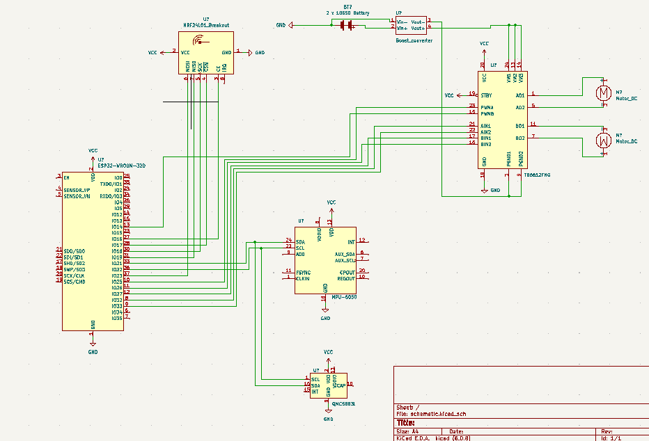

# ESP32 self balancing robot V2

A self balancing robot I am building.

Design decisions: 

- **CONTROLLER** - ESP32 for the controller. It is overkill for this but it is good for me because it gives me experience with Espressiv IDF. Another reason not to choose esp32 for this is that it is very big, at least the devkit 4, i had to cut the breadboard in half to fit it. I am using C to program it as I really don't like how C++ handles objects and how the whole declaring the variables for the class in the header thing works.

- **MOTORS** - For motors that it will roll on I chose simple 3-6V DC motors, because at the time it was all I had. I saw other people using stepper motors, but that seemed like overkill. After learning PID I think that I made a good decision as DC motors are non linear and thats what PID is really good at controlling. Stepper motors would have been a bit like cheating I feel, due to them being very consistent. Stepper motors also consume more energy so thats a bad thing. 

- **POWER** - For power I am using two 18650 batteries which is more than enough to power two DC motors. I am also using a over-voltage and under-voltage protected battery power board. The power board has direct outputs for 5V and 3.3V so I am just powering the motors with 5V instead of 6V, it seems to be working fine for now.

- **MOTOR CONTROL** - For motor control I am using a h-bridge driver chip tb6612. Its a lot more efficient and lighter than the L298N. The motors are driven directly from the battery board as said before. The logic of the chip I am controlling with 3.3V.

- **SENSORS V1** - To manage the balancing I made some sensor choices, first used a adxl345. I wanted to learn why it was not a good choice to go with accelerometer alone. After implementing and configuring PID for it, it was too influenced by the accelerations when it attempted to correct itself.

- **SENSORS V2** - After adxl345 I got a mpu6050 which is a lot more precise at measuring acceleration and has a gyro on it. The gyro worked very well for balancing as it was not affected much by acceleration but was drifting slowly because of noise being added to the dead reckoning. The accelerometer data is converted into pitch and roll data.

- **SENSORS V3** - To help with gyro noise I saw some recommendations to get a magnetometer. I got a gy271(qmc5883l) magnetometer from china (maybe a fake one) which works quite good after being calibrated (used MicWro Engr video to do calibration). Sometimes after not touching it for a few days I have to recalibrate it, which is a pain. Have figured out how to get NED coordinates from accelerometer + magnetometer but these so far have not been of any use. I am instead converting the magnetometer data to yaw.

- **SENSOR FUSION** - To get some meaningful data from the sensors sensor fusion is used to combine them and fix some of their flaws that they have individually. The accelerometer + magnetometer produce pitch roll and yaw which are used to determine the initial position on power on of the robot, this tells gyro where to go initially to be upward. I am then using a complementary filter to merge the mag + accel and gyro readings into something that is with less noise and more stable. I basically take 98% of a reading form the gyro and 2% of a reading from mag+accel(pitch, roll, yaw) and combine them to get a reading for the gyro without the noise or at least noise that fixes itself as time goes on.
 Here is an example of the gyro degrees correcting itself after a motion(middle graph). If it weren't for the filter it would be slightly off after returning to the initial position.

- **REMOTE CONTROL** - For controlling the robot as a first attempt I used an ESP01, I didn't use the onboard esp32 wifi module because it would be too easy. I implemented a server on the ESP01 using AT commands (some of the chips are bad and cant handle the server functionality, I had to find the right one). It worked well, it is a bit of performance intensive because it needs to trim the http request to only have the query url with joystick parameters, and it was a pain to implement this many string manipulations in C. In the end this proved to be too unstable due to the chip I think, the firmware might have been bad on it, I did not have energy to deal with it and flash it again. The ESP01 would crash every 20 seconds with usb power from my laptop, but on pure battery power it would crash constantly, so i dropped that idea. I decided to go with a nrf24l01 radio transceiver that I will implement once I get the robot to balance.

- **PID** - PID is used to manage the control of the balancing. Some parameter is picked that correctly determines if the robot is upright, a goal for the parameter is set which pid will attempt to reach by calculating differences between measurements from sensors and measurement goals for those sensors. This will then use the difference in measurements to say to the motors how much to go in which direction. Each step of PID has a set gain for it for how much to use of a specific measurement to calculate the difference. Right now only proportional and integration parts of PID are used as I haven't figured out how to calculate the the derivative using the readings.

- **FRAME** - The body of the robot was made in Fusion 360 and is mainly based on the measurements of the biggest parts that make the robot, the battery board and the controller with its sensors. Special prongs are made for the motors on the sides, that fit nicely with the motor transmissions.  The frame has some flaws, it is made in 3 levels the top level on which sits the sensors and the esp32, the top level only has one wall on top of which the platform sits. This lack of support for the controller level makes it able to flex when being handled, the frame does not break but it is a bad design because it can impact the sensor angular readings. So far this has not impacted the readings though. The motor mounts are also a bit flimsy but that is because the motor transmission has small mount holes to begin with. Adding hot glue around the motor transmission helps relieve some of the stress on the prongs. I fixed the lack of supports by adding a perf board cutout to the opposite side of the first support and it works well.
 In general a lot of things that have to stay in place on the robot are fastened with hot glue as it would be too time intensive to design specific mount options. This is done to make sure the sensors are parallel, the battery is mounted and not wobbling, esp01 is mounted where it doesn't dangle.
 All the components were 3d printed of course, I learned that having a margin of 0.1mm for parts is good if it is supposed to be a tight fit.
 A sketch of the measurements can be seen below: 

- **WHEELS** - The wheels fitted to the motors are made as small as possible in diameter to has as much torque as possible from those small motors, don't want it to slip. A little groove is made in the wheels to place a rubber band in them to aid with grip, this is a not very good decision during testing as they fall of if the wheel has sideways motion, would be better to have these when testing is finished. Without the rubber bands the weight of the robot with all components is also enoughs to prevent it from sliding around, at least on wooden desk.

