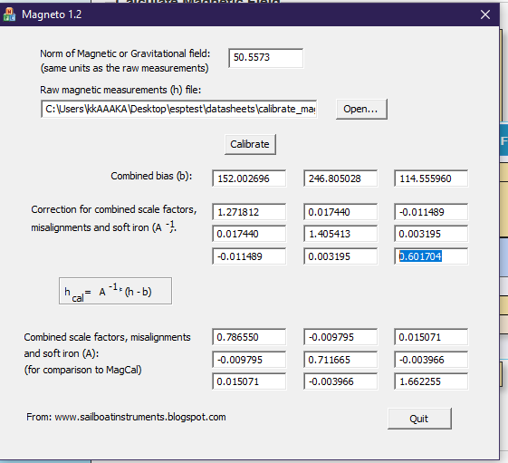
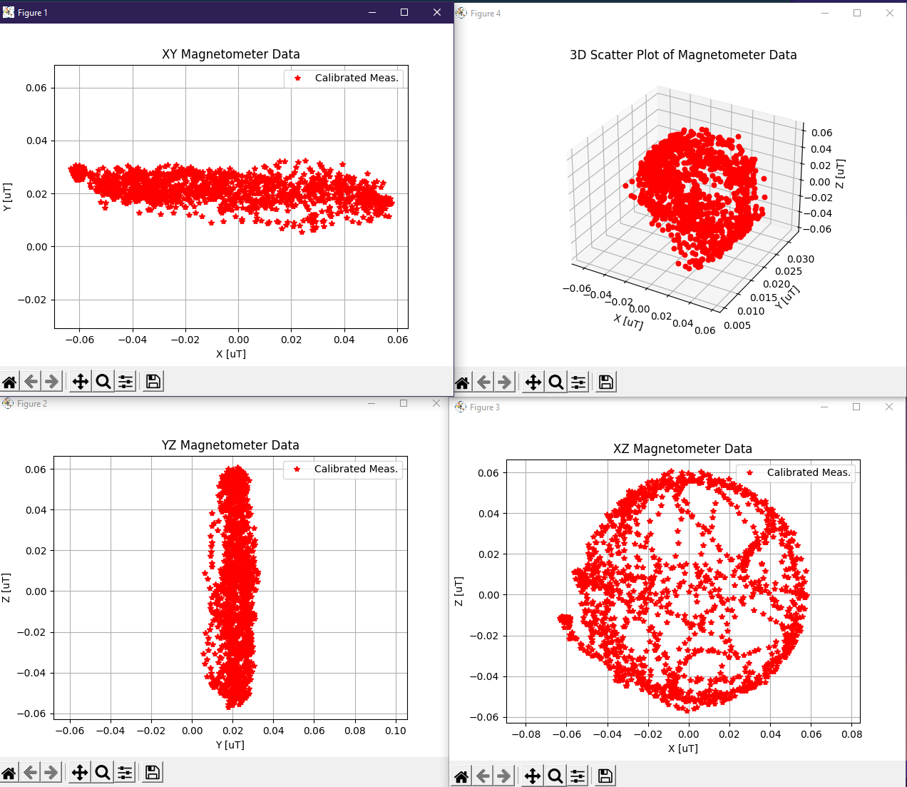

# How to calibrate QMC5883l

1. Disable the existing corrections for soft iron and hard iron. Like code bellow

```C
float hard_iron_correction[3] = {
    0, 0, 0
};
float soft_iron_correction[3][3] = {
    {1,0,0},
    {0,1,0},
    {0,0,1}
};
```

2. Disable axis switching for magnetometer readings

```C
// fix_mag_axis(magnetometer_data);
```

3. Print out magnetometer readings without commas at the end of every loop.

```C
printf("%6.5f %6.5f %6.5f", magnetometer_data[0], magnetometer_data[1], magnetometer_data[2]);
printf("\n"); 
```

4. Start the robot loop with usb connected. Listen to UART communication and gather it into a txt file. You have to spin the robot all around to make sure to get the maximums and minimums of each axis of the magnetometer. Example bellow with corrections already made - 

```
0.05614, 0.02117,  0.06373
0.05780, 0.02252,  0.06302
0.05780, 0.02252,  0.06302
0.05644, 0.02096,  0.06373
0.05644, 0.02096,  0.06373
0.05748, 0.02097,  0.06302
0.05748, 0.02097,  0.06302
0.05656, 0.02096,  0.06359
0.05656, 0.02096,  0.06359
0.05748, 0.02063,  0.06345
0.05748, 0.02063,  0.06345
0.05644, 0.02151,  0.06231
0.05644, 0.02151,  0.06231
```

5. Go to https://www.ngdc.noaa.gov/geomag/calculators/magcalc.shtml#igrfwmm and find your "Norm of magnetic field". The value is going to be in nano teslas, be aware of that. For me in Denmark it is 50557nT.

6. Open "Magneto 1.2". Point it to your txt file with magnetometer readings. Put in the Norm of magnetic field value in THE SAME UNITS as the magnetometer readings. In this case my readings are in micro tesla and the norm is in nano tesla, convert that to micro teslas also. Converting the value gives weird readings but i guess that is supposed to be the correct way. Get the calibrations from Magneto. Combined bias is hard iron calibration and the 3x3 grid bellow that is the soft iron one.


7. Plug the calibrations into our calibration arrays.

```C
float hard_iron_correction[3] = {
    152.002696, 246.805028, 114.555960
};

float soft_iron_correction[3][3] = {
    {1.271812,0.017440,-0.011489},
    {0.017440,1.405413,0.003195},
    {-0.011489,0.003195,0.601704}
};
```

8. Undo the commented out axis switch.

```C
fix_mag_axis(magnetometer_data);
```

9. Compare the previous magnetometer measurements and the calibrated ones. This is how a well calibrated one looks like. I had a bad magnetometer at first so i switched mine for a new one and then it worked very good.


# EXCEPTION SCENARIOS

### One axis is fucked in terms of range even after calibration



What I tried in this case was to put a magnet next to the magnetometer, but not touch it with it. This makes it go wild but may help in getting an axis unstuck.

This is my readings from magnetometer that was calibrated before and after I put a magnet next to it. Bellow is the image. You can see the y axis was stuck before and now the x axis is stuck. At least something changed.


Either you do this or just switch to a different magnetometer of the same kind.